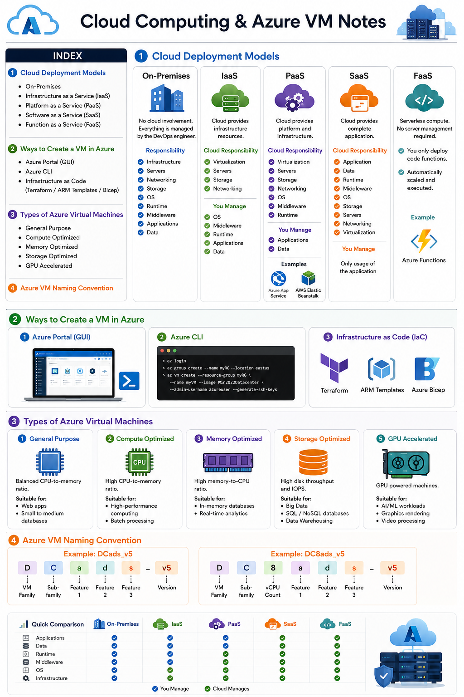
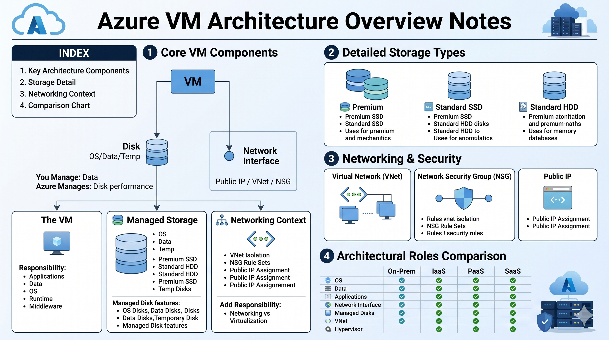
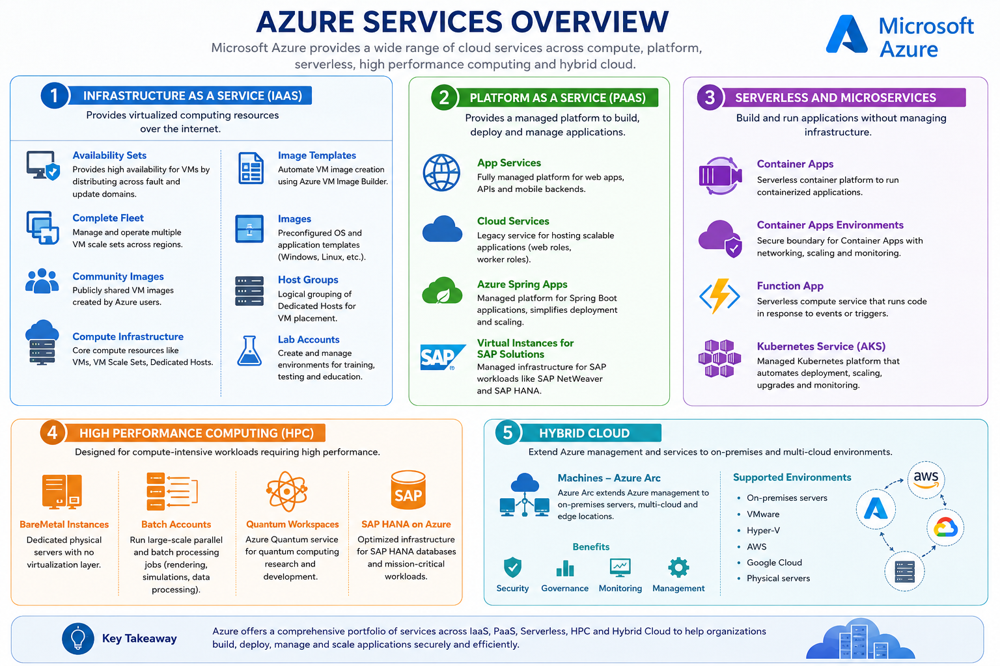

# 📘 Cloud Computing & Azure VM Notes

## 📑 Index

- [📘 Cloud Computing \& Azure VM Notes](#-cloud-computing--azure-vm-notes)
  - [📑 Index](#-index)
  - [☁️ Cloud Deployment Models](#️-cloud-deployment-models)
    - [1. On-Premises](#1-on-premises)
    - [2. Infrastructure as a Service (IaaS)](#2-infrastructure-as-a-service-iaas)
    - [3. Platform as a Service (PaaS)](#3-platform-as-a-service-paas)
    - [4. Software as a Service (SaaS)](#4-software-as-a-service-saas)
    - [5. Function as a Service (FaaS)](#5-function-as-a-service-faas)
  - [☁️ Ways to Create a VM in Azure](#️-ways-to-create-a-vm-in-azure)
  - [💻 Types of Azure Virtual Machines](#-types-of-azure-virtual-machines)
    - [1. General Purpose](#1-general-purpose)
    - [2. Compute Optimized](#2-compute-optimized)
    - [3. Memory Optimized](#3-memory-optimized)
    - [4. Storage Optimized](#4-storage-optimized)
    - [5. GPU Accelerated](#5-gpu-accelerated)
  - [🧩 Azure VM Naming Convention](#-azure-vm-naming-convention)
    - [Example: `DCads_v5`](#example-dcads_v5)
    - [Example: `DC8ads_v5`](#example-dc8ads_v5)
- [Azure Info](#azure-info)
- [How to create VM in Azure](#how-to-create-vm-in-azure)
  - [🚀 1. Images](#-1-images)
    - [a. Marketplace Image](#a-marketplace-image)
    - [b. Custom Images](#b-custom-images)
    - [c. Shared Images (Community Images)](#c-shared-images-community-images)
    - [d. Managed Images](#d-managed-images)
  - [💾 2. Disk Types](#-2-disk-types)
    - [a. OS Disk](#a-os-disk)
    - [b. Data Disk](#b-data-disk)
    - [c. Temporary Disk / Local Storage](#c-temporary-disk--local-storage)
  - [🌐 3. Networking](#-3-networking)
    - [VM Networking Flow:](#vm-networking-flow)
  - [🔐 4. Authentication](#-4-authentication)
    - [Options:](#options)
    - [Best Practice:](#best-practice)
  - [⚙️ 5. VM Sizes](#️-5-vm-sizes)
  - [🏗️ 6. VM Architecture Overview](#️-6-vm-architecture-overview)
- [Azure Virtual Machine Creation with SSH Key Login](#azure-virtual-machine-creation-with-ssh-key-login)
  - [Objective](#objective)
  - [Prerequisites](#prerequisites)
  - [Step 1: Create a Virtual Machine](#step-1-create-a-virtual-machine)
    - [Basic Configuration](#basic-configuration)
      - [Resource Group](#resource-group)
      - [Virtual Machine Details](#virtual-machine-details)
      - [Image Selection](#image-selection)
      - [Size Selection](#size-selection)
  - [Step 2: Configure SSH Authentication](#step-2-configure-ssh-authentication)
    - [Authentication Type](#authentication-type)
    - [Username](#username)
    - [SSH Public Key Source](#ssh-public-key-source)
  - [Step 3: Review and Create](#step-3-review-and-create)
  - [Step 4: Go to the Virtual Machine](#step-4-go-to-the-virtual-machine)
  - [Step 5: Obtain Public IP Address](#step-5-obtain-public-ip-address)
  - [Step 6: Connect to the Virtual Machine](#step-6-connect-to-the-virtual-machine)
  - [Step 7: Login Using SSH](#step-7-login-using-ssh)
    - [Linux / macOS](#linux--macos)
    - [If Using a Private Key File](#if-using-a-private-key-file)
  - [Verify Connection](#verify-connection)
  - [Benefits of SSH Key Authentication](#benefits-of-ssh-key-authentication)
  - [Architecture Flow](#architecture-flow)
  - [SSH Login Command](#ssh-login-command)
- [Azure Virtual Machine Creation with RDP Login](#azure-virtual-machine-creation-with-rdp-login)
  - [Objective](#objective-1)
  - [Prerequisites](#prerequisites-1)
  - [Step 1: Create a Virtual Machine](#step-1-create-a-virtual-machine-1)
  - [Step 2: Configure Basic Settings](#step-2-configure-basic-settings)
    - [Resource Group](#resource-group-1)
    - [Virtual Machine Details](#virtual-machine-details-1)
  - [Step 3: Select Windows Image](#step-3-select-windows-image)
  - [Step 4: Configure Administrator Account](#step-4-configure-administrator-account)
    - [Username](#username-1)
    - [Password](#password)
    - [Confirm Password](#confirm-password)
  - [Step 5: Configure Inbound Port Rules](#step-5-configure-inbound-port-rules)
  - [Step 6: Review and Create](#step-6-review-and-create)
  - [Step 7: Open the Virtual Machine](#step-7-open-the-virtual-machine)
  - [Step 8: Connect to the Windows VM](#step-8-connect-to-the-windows-vm)
  - [Step 9: Open the RDP File](#step-9-open-the-rdp-file)
  - [Step 10: Enter Credentials](#step-10-enter-credentials)
    - [Username](#username-2)
    - [Password](#password-1)
  - [Step 11: Accept Certificate Warning](#step-11-accept-certificate-warning)
  - [Step 12: Access the Windows Desktop](#step-12-access-the-windows-desktop)
  - [Verify the Connection](#verify-the-connection)
  - [Architecture Flow](#architecture-flow-1)
  - [RDP Port](#rdp-port)
  - [Benefits of RDP](#benefits-of-rdp)
  - [Summary](#summary)
- [Azure Services Overview for Interviews](#azure-services-overview-for-interviews)
  - [Introduction](#introduction)
- [1. Infrastructure as a Service (IaaS)](#1-infrastructure-as-a-service-iaas)
  - [Services](#services)
    - [Availability Sets](#availability-sets)
    - [Complete Fleet](#complete-fleet)
    - [Community Images](#community-images)
    - [Compute Infrastructure](#compute-infrastructure)
    - [Image Templates](#image-templates)
    - [Images](#images)
    - [Host Groups](#host-groups)
    - [Lab Accounts](#lab-accounts)
- [2. Platform as a Service (PaaS)](#2-platform-as-a-service-paas)
  - [Services](#services-1)
    - [App Services](#app-services)
    - [Cloud Services](#cloud-services)
    - [Azure Spring Apps](#azure-spring-apps)
    - [Virtual Instances for SAP Solutions](#virtual-instances-for-sap-solutions)
- [3. Serverless and Microservices](#3-serverless-and-microservices)
  - [Services](#services-2)
    - [Container Apps](#container-apps)
    - [Container Apps Environments](#container-apps-environments)
    - [Function App](#function-app)
    - [Azure Kubernetes Service (AKS)](#azure-kubernetes-service-aks)
- [4. High Performance Computing (HPC)](#4-high-performance-computing-hpc)
  - [Services](#services-3)
    - [BareMetal Instances](#baremetal-instances)
    - [Batch Accounts](#batch-accounts)
    - [Quantum Workspaces](#quantum-workspaces)
    - [SAP HANA on Azure](#sap-hana-on-azure)
- [5. Hybrid Cloud](#5-hybrid-cloud)
  - [Services](#services-4)
    - [Machines – Azure Arc](#machines--azure-arc)
- [Interview Answer](#interview-answer)
  - [What are the major service categories in Azure?](#what-are-the-major-service-categories-in-azure)
    - [Infrastructure as a Service (IaaS)](#infrastructure-as-a-service-iaas)
    - [Platform as a Service (PaaS)](#platform-as-a-service-paas)
    - [Serverless and Microservices](#serverless-and-microservices)
    - [High Performance Computing (HPC)](#high-performance-computing-hpc)
    - [Hybrid Cloud](#hybrid-cloud)
- [Quick Summary Table](#quick-summary-table)
- [Azure Services](#azure-services)
- [Azure Subscription and Resource Groups](#azure-subscription-and-resource-groups)
  - [Introduction](#introduction-1)
- [Azure Subscription](#azure-subscription)
  - [Types of Azure Subscriptions](#types-of-azure-subscriptions)
    - [1. Free Account](#1-free-account)
      - [Features](#features)
    - [2. Pay-As-You-Go Subscription](#2-pay-as-you-go-subscription)
      - [Features](#features-1)
- [Azure VM Operations (User Data, Run Command, Resize, Reset Password, Monitoring)](#azure-vm-operations-user-data-run-command-resize-reset-password-monitoring)
  - [1. VM Creation with User Data](#1-vm-creation-with-user-data)
    - [Step 1: Create Virtual Machine](#step-1-create-virtual-machine)
    - [Step 2: Configure User Data](#step-2-configure-user-data)
    - [Step 3: Review and Create](#step-3-review-and-create-1)
    - [Step 4: Login to VM](#step-4-login-to-vm)
    - [Step 5: Verify Nginx Installation](#step-5-verify-nginx-installation)
  - [2. Configure Inbound Rule for Nginx](#2-configure-inbound-rule-for-nginx)
  - [3. Run Command (RunShellScript)](#3-run-command-runshellscript)
- [Resize Virtual Machine](#resize-virtual-machine)
- [Reset VM Password](#reset-vm-password)
- [Monitoring Virtual Machine](#monitoring-virtual-machine)
- [Azure Monitor](#azure-monitor)
- [Activity Log](#activity-log)
- [Interview Question](#interview-question)
  - [What will you do if a Virtual Machine is not responding?](#what-will-you-do-if-a-virtual-machine-is-not-responding)
    - [Step 1: Check Activity Logs](#step-1-check-activity-logs)
    - [Step 2: Check Monitoring](#step-2-check-monitoring)
    - [Step 3: Verify VM Status](#step-3-verify-vm-status)
    - [Step 4: Use Run Command](#step-4-use-run-command)
- [Important VM Operations](#important-vm-operations)
- [Architecture Flow](#architecture-flow-2)
- [Azure VM Images](#azure-vm-images)
  - [Overview](#overview)
  - [Azure Image Creation Process](#azure-image-creation-process)
    - [Step 1: Open the VM](#step-1-open-the-vm)
    - [Step 2: Configure Azure Compute Gallery](#step-2-configure-azure-compute-gallery)
    - [Step 3: Select Operating System State](#step-3-select-operating-system-state)
      - [Generalized Image](#generalized-image)
      - [Specialized Image](#specialized-image)
    - [Step 4: Create VM Image Definition](#step-4-create-vm-image-definition)
  - [Important Note](#important-note)
- [Types of Azure Images](#types-of-azure-images)
  - [1. Marketplace Images](#1-marketplace-images)
  - [2. Custom Images](#2-custom-images)
  - [3. Shared Image Gallery (SIG)](#3-shared-image-gallery-sig)
- [Practical Example](#practical-example)
    - [Step 1](#step-1)
    - [Step 2](#step-2)
    - [Step 3](#step-3)
    - [Step 4](#step-4)
    - [Step 5](#step-5)
- [Benefits of Azure Images](#benefits-of-azure-images)
- [Architecture Flow](#architecture-flow-3)

---

## ☁️ Cloud Deployment Models

### 1. On-Premises

- No cloud involvement
- Everything is managed by the DevOps engineer
- Full responsibility includes:
  - Infrastructure
  - Servers
  - Networking
  - Storage
  - OS
  - Runtime
  - Middleware
  - Applications
  - Data

---

### 2. Infrastructure as a Service (IaaS)

**Cloud provides:**

- Virtualization
- Servers
- Storage
- Networking

**Customer responsibility:**

- Operating System (OS)
- Middleware
- Runtime
- Applications
- Data

---

### 3. Platform as a Service (PaaS)

**Cloud provides:**

- Virtualization
- Servers
- Storage
- Networking
- Operating System (OS)
- Middleware
- Runtime

**Customer responsibility:**

- Applications
- Data

**Examples:**

- Azure App Service
- AWS Elastic Beanstalk

---

### 4. Software as a Service (SaaS)

**Cloud provides everything:**

- Application
- Data
- Runtime
- Middleware
- OS
- Storage
- Servers
- Networking
- Virtualization

**User responsibility:**

- Only usage of the application

---

### 5. Function as a Service (FaaS)

- Serverless computing model
- No server management required
- You only deploy code functions
- Automatically scaled and executed

**Example:**

- Azure Functions

---

## ☁️ Ways to Create a VM in Azure

1. **Azure Portal (GUI)**
2. **Azure CLI (Command Line Interface)**
3. **Infrastructure as Code (IaC)**
   - Terraform
   - ARM Templates
   - Azure Bicep

---

## 💻 Types of Azure Virtual Machines

### 1. General Purpose

- Balanced CPU-to-memory ratio
- Suitable for web apps and small databases

---

### 2. Compute Optimized

- High CPU-to-memory ratio
- Suitable for high-performance computing

---

### 3. Memory Optimized

- High memory-to-CPU ratio
- Suitable for in-memory databases and analytics

---

### 4. Storage Optimized

- High disk throughput and IOPS
- Suitable for Big Data, SQL, NoSQL, Data Warehousing

---

### 5. GPU Accelerated

- GPU powered machines
- Suitable for AI/ML, graphics rendering, video processing

---

## 🧩 Azure VM Naming Convention

### Example: `DCads_v5`

- **D** → VM Family
- **C** → Sub-family
- **a** → Feature 1
- **d** → Feature 2
- **s** → Feature 3
- **v5** → Version

---

### Example: `DC8ads_v5`

- **D** → VM Family
- **C** → Sub-family
- **8** → vCPU count
- **a** → Feature 1
- **d** → Feature 2
- **s** → Feature 3
- **v5** → Version

---

# Azure Info



---

# How to create VM in Azure

## 🚀 1. Images

Azure VM creation starts with selecting an image:

### a. Marketplace Image

- Pre-built images provided by Azure
- Examples:
  - Ubuntu
  - Red Hat
  - Windows Server

---

### b. Custom Images

- Your own VM image created from an existing machine
- Used for:
  - Project-specific environments
  - Pre-configured applications
  - Reusable VM templates

---

### c. Shared Images (Community Images)

- Images shared across regions or organizations
- Example:
  - Image created in `central india` can be used in `ap-south-2`
- Useful for:
  - Cross-region deployments
  - Standardized environments

---

### d. Managed Images

- Lightweight reusable VM images
- Used for quick deployments
- Example:
  - Nginx server image
- Best for:
  - Small, repeated deployments
  - Fast provisioning

---

## 💾 2. Disk Types

### a. OS Disk

- Stores operating system files
- Fully persistent storage
- Type: **Non-ephemeral**
- Data is NOT lost if VM stops or restarts

---

### b. Data Disk

- Used for application data
- Attached separately from OS disk
- Can be expanded independently

---

### c. Temporary Disk / Local Storage

- Used for cache and temporary files
- Type: **Ephemeral storage**
- Data is LOST when VM is deleted or restarted
- Best for:
  - Temporary processing
  - Cache files

---

## 🌐 3. Networking

VM networking components:

- **Virtual Network (VNet / VPC equivalent)**
- **Network Interface (NIC)**
- **Public IP Address**
- **Network Security Group (NSG)**

### VM Networking Flow:

- > VM → Network Interface → VNet → Public IP → NSG Rules

---

## 🔐 4. Authentication

### Options:

- Username & Password
- SSH Key-Based Authentication (Recommended)

### Best Practice:

- Use SSH keys for Linux VMs
- More secure than password-based login

---

## ⚙️ 5. VM Sizes

- Defines CPU, Memory, and performance capacity
- Choose based on workload:
  - Web apps → General Purpose
  - Heavy compute → Compute Optimized
  - Large memory apps → Memory Optimized
  - Big data → Storage Optimized
  - AI/ML → GPU Optimized

---

## 🏗️ 6. VM Architecture Overview



---

# Azure Virtual Machine Creation with SSH Key Login

## Objective

Create an Azure Virtual Machine and access it securely using SSH Key Authentication.

---

## Prerequisites

- Azure Subscription
- SSH Public Key (`.pub` file)
- SSH Private Key (`.pem` or private key file stored securely on your local machine)

---

## Step 1: Create a Virtual Machine

1. Login to the Azure Portal.
2. Search for **Virtual Machines**.
3. Click **Create** → **Azure Virtual Machine**.

### Basic Configuration

#### Resource Group

- Select an existing Resource Group or create a new one.

#### Virtual Machine Details

- Enter the **Virtual Machine Name**.
- Select the **Region/Zone**.
- Choose the **Availability Options** (if required).

#### Image Selection

Choose the Operating System image:

- Ubuntu Server
- Red Hat Enterprise Linux
- CentOS
- Windows Server

#### Size Selection

Choose the VM size based on project requirements.

Example:

- Standard_B1s
- Standard_B2s
- Standard_D2s_v3

---

## Step 2: Configure SSH Authentication

Under the **Administrator Account** section:

### Authentication Type

Select:

```
SSH Public Key
```

### Username

Provide a username.

Example:

```bash
ubuntu
```

### SSH Public Key Source

Choose one of the following:

- Generate new key pair
- Use existing public key

If using an existing key:

Paste the contents of your public key file.

Example:

```bash
ssh-rsa AAAAB3NzaC1yc2EAAAADAQABAAABAQ...
```

---

## Step 3: Review and Create

1. Click **Review + Create**.
2. Azure will validate the configuration.
3. Click **Create**.

---

## Step 4: Go to the Virtual Machine

After deployment completes:

1. Click **Go to Resource**.
2. Navigate to the VM Overview page.

---

## Step 5: Obtain Public IP Address

From the VM Overview page, copy the:

```text
Public IP Address
```

Example:

```text
20.204.15.100
```

---

## Step 6: Connect to the Virtual Machine

Click:

```text
Connect → SSH
```

Azure will display the SSH connection command.

Example:

```bash
ssh ubuntu@20.204.15.100
```

---

## Step 7: Login Using SSH

### Linux / macOS

```bash
ssh ubuntu@<public-ip>
```

Example:

```bash
ssh ubuntu@20.204.15.100
```

### If Using a Private Key File

```bash
ssh -i mykey.pem ubuntu@20.204.15.100
```

---

## Verify Connection

After successful login, you should see:

```bash
ubuntu@vm-name:~$
```

Check system information:

```bash
hostname
```

```bash
uname -a
```

```bash
df -h
```

---

## Benefits of SSH Key Authentication

- More secure than passwords.
- Protects against brute-force attacks.
- Industry-standard authentication method.
- Recommended for production environments.

---

## Architecture Flow

```text
Local Machine
      |
      | SSH Private Key
      |
      V
Azure VM
      |
      | SSH Public Key
      |
      V
Authenticated Login
```

---

## SSH Login Command

```bash
ssh <username>@<public-ip>
```

Example:

```bash
ssh ubuntu@20.204.15.100
```

---

# Azure Virtual Machine Creation with RDP Login

## Objective

Create a Windows Virtual Machine in Azure and connect to it using Remote Desktop Protocol (RDP).

---

## Prerequisites

- Azure Subscription
- Internet Connection
- Windows Operating System (or Remote Desktop Client installed)

---

## Step 1: Create a Virtual Machine

1. Login to the Azure Portal.
2. Search for **Virtual Machines**.
3. Click **Create** → **Azure Virtual Machine**.

---

## Step 2: Configure Basic Settings

### Resource Group

- Select an existing Resource Group or create a new one.

### Virtual Machine Details

Provide the following details:

- Virtual Machine Name
- Region
- Availability Zone

Example:

```text
VM Name : windows-vm
Region  : Central India
Zone    : Zone 1
```

---

## Step 3: Select Windows Image

Under the **Image** section, choose a Windows operating system.

Examples:

- Windows Server 2019 Datacenter
- Windows Server 2022 Datacenter

---

## Step 4: Configure Administrator Account

Provide the following credentials:

### Username

```text
azureuser
```

### Password

```text
********
```

### Confirm Password

```text
********
```

> Note: Store the password securely as it will be required for RDP login.

---

## Step 5: Configure Inbound Port Rules

Under **Inbound Port Rules**, select:

```text
Allow selected ports
```

Choose:

```text
RDP (3389)
```

Port:

```text
3389
```

This allows Remote Desktop connections to the Windows VM.

---

## Step 6: Review and Create

1. Click **Review + Create**.
2. Azure validates the configuration.
3. Once validation passes, click **Create**.

---

## Step 7: Open the Virtual Machine

After deployment is completed:

1. Click **Go to Resource**.
2. Open the VM Overview page.

---

## Step 8: Connect to the Windows VM

Click:

```text
Connect → RDP
```

Azure displays the connection details.

Click:

```text
Download RDP File
```

---

## Step 9: Open the RDP File

1. Locate the downloaded `.rdp` file.
2. Double-click the file.

Example:

```text
windows-vm.rdp
```

---

## Step 10: Enter Credentials

When prompted:

### Username

```text
azureuser
```

### Password

Enter the password specified during VM creation.

```text
********
```

Click:

```text
OK / Connect
```

---

## Step 11: Accept Certificate Warning

You may see a security certificate warning.

Click:

```text
Yes
```

to continue.

---

## Step 12: Access the Windows Desktop

After successful authentication, the Remote Desktop session opens.

You will see the Windows Server desktop.

Example:

```text
Windows Server 2022 Datacenter
```

You can now perform administrative tasks on the VM.

---

## Verify the Connection

Open Command Prompt and run:

```cmd
hostname
```

Check system details:

```cmd
systeminfo
```

Check IP configuration:

```cmd
ipconfig
```

---

## Architecture Flow

```text
Local Machine
      |
      | RDP Port 3389
      |
      V
Azure Windows VM
      |
      | Username + Password
      |
      V
Remote Desktop Session
```

---

## RDP Port

Default RDP Port:

```text
3389
```

---

## Benefits of RDP

- Graphical User Interface (GUI) access.
- Easy administration of Windows servers.
- Remote software installation and management.
- Secure remote access using credentials.

---

## Summary

1. Create Windows VM.
2. Configure Username and Password.
3. Allow RDP Port 3389.
4. Review and Create VM.
5. Download RDP File.
6. Open RDP File.
7. Enter Credentials.
8. Connect to Windows Desktop.

---

# Azure Services Overview for Interviews

## Introduction

Microsoft Azure provides a wide range of cloud services that are broadly categorized into:

1. Infrastructure as a Service (IaaS)
2. Platform as a Service (PaaS)
3. Serverless and Microservices
4. High Performance Computing (HPC)
5. Hybrid Cloud

Understanding these categories is important for Azure Administrator, Azure DevOps Engineer, and Cloud Engineer interviews.

---

# 1. Infrastructure as a Service (IaaS)

IaaS provides virtualized computing resources over the internet. Azure manages the physical infrastructure, while the customer manages operating systems, applications, networking, and storage.

## Services

### Availability Sets

- Provides high availability for Virtual Machines.
- Protects applications from hardware failures and planned maintenance.
- Distributes VMs across Fault Domains and Update Domains.

### Complete Fleet

- Azure Fleet Management helps manage and operate multiple VM Scale Sets across regions.
- Improves scalability and availability.

### Community Images

- Publicly shared VM images created by Azure users.
- Can be reused across subscriptions.

### Compute Infrastructure

- Core compute services such as:
  - Virtual Machines (VMs)
  - Virtual Machine Scale Sets (VMSS)
  - Dedicated Hosts

### Image Templates

- Automates VM image creation.
- Uses Azure VM Image Builder to create standardized images.

### Images

- Preconfigured operating system and application templates.
- Examples:
  - Ubuntu
  - Red Hat
  - Windows Server

### Host Groups

- Logical grouping of Dedicated Hosts.
- Helps control VM placement and licensing requirements.

### Lab Accounts

- Used in Azure Lab Services.
- Creates and manages environments for training, testing, and education.

---

# 2. Platform as a Service (PaaS)

PaaS provides a managed platform where developers can deploy applications without managing servers.

## Services

### App Services

- Fully managed web hosting service.
- Used for:
  - Web Applications
  - REST APIs
  - Mobile Backends

### Cloud Services

- Legacy Azure service for hosting scalable applications.
- Supports web roles and worker roles.

### Azure Spring Apps

- Managed platform for Spring Boot applications.
- Simplifies deployment and scaling of Java applications.

### Virtual Instances for SAP Solutions

- Managed infrastructure for SAP workloads.
- Supports SAP NetWeaver and SAP HANA deployments.

---

# 3. Serverless and Microservices

Serverless services allow developers to focus on code without managing infrastructure.

## Services

### Container Apps

- Serverless container platform.
- Deploy containerized applications without Kubernetes management.

### Container Apps Environments

- Secure boundary for Container Apps.
- Provides networking, monitoring, and scaling features.

### Function App

- Azure Functions service.
- Executes code based on events or triggers.
- Billing is based on execution time.

Example Triggers:

- HTTP Request
- Blob Storage
- Queue Message
- Timer Trigger

### Azure Kubernetes Service (AKS)

- Managed Kubernetes platform.
- Automates:
  - Cluster deployment
  - Scaling
  - Upgrades
  - Monitoring

---

# 4. High Performance Computing (HPC)

Designed for compute-intensive workloads requiring high performance.

## Services

### BareMetal Instances

- Dedicated physical servers.
- No virtualization layer.
- Used for enterprise applications and SAP workloads.

### Batch Accounts

- Runs large-scale parallel and batch processing jobs.
- Commonly used in:
  - Rendering
  - Simulations
  - Data Processing

### Quantum Workspaces

- Azure Quantum service.
- Used for quantum computing research and development.

### SAP HANA on Azure

- Optimized infrastructure for SAP HANA databases.
- Supports mission-critical enterprise workloads.

---

# 5. Hybrid Cloud

Hybrid cloud combines on-premises infrastructure with Azure cloud services.

## Services

### Machines – Azure Arc

Azure Arc extends Azure management to:

- On-Premises Servers
- Multi-Cloud Environments
- Edge Locations

Benefits:

- Centralized Management
- Governance
- Security
- Monitoring

Supported Environments:

- VMware
- Hyper-V
- AWS
- Google Cloud
- Physical Servers

---

# Interview Answer

## What are the major service categories in Azure?

Azure services are mainly categorized into:

### Infrastructure as a Service (IaaS)

- Availability Sets
- Community Images
- Compute Infrastructure
- Image Templates
- Images
- Host Groups
- Lab Accounts

### Platform as a Service (PaaS)

- App Services
- Cloud Services
- Azure Spring Apps
- Virtual Instances for SAP Solutions

### Serverless and Microservices

- Container Apps
- Container Apps Environments
- Function Apps
- Azure Kubernetes Service (AKS)

### High Performance Computing (HPC)

- BareMetal Instances
- Batch Accounts
- Quantum Workspaces
- SAP HANA on Azure

### Hybrid Cloud

- Azure Arc Machines

These services help organizations build, deploy, manage, and scale applications across cloud, on-premises, and hybrid environments.

---

# Quick Summary Table

| Category     | Services                                                  |
| ------------ | --------------------------------------------------------- |
| IaaS         | VMs, Availability Sets, Images, Host Groups, Lab Accounts |
| PaaS         | App Services, Cloud Services, Azure Spring Apps           |
| Serverless   | Function Apps, Container Apps, AKS                        |
| HPC          | BareMetal Instances, Batch Accounts, Quantum Workspaces   |
| Hybrid Cloud | Azure Arc Machines                                        |

---

# Azure Services



---

# Azure Subscription and Resource Groups

## Introduction

Microsoft Azure provides cloud services through a subscription-based model. Before creating any Azure resources, a user must have an Azure Subscription. Resources are then organized and managed using Resource Groups.

---

# Azure Subscription

An Azure Subscription is a logical unit that provides access to Azure services and is used for billing, resource management, and access control.

## Types of Azure Subscriptions

### 1. Free Account

* Provides free Azure credits for a limited period.
* Includes access to several Azure services with free usage limits.
* Suitable for learning, testing, and practice purposes.

#### Features

* Free trial credits.
* Limited service usage.
* No charges until free credits are exhausted.

---

### 2. Pay-As-You-Go Subscription

* Users pay only for the resources they consume.
* No upfront commitment required.
* Suitable for production environments and enterprise workloads.

#### Features

* Flexible pricing model.
* Unlimited resource creation based on requirements.
* Monthly billing based on actual usage.

---

# Azure VM Operations (User Data, Run Command, Resize, Reset Password, Monitoring)

## 1. VM Creation with User Data

### Step 1: Create Virtual Machine

1. Login to Azure Portal.
2. Navigate to **Virtual Machines**.
3. Click **Create → Azure Virtual Machine**.
4. Create or select a **Resource Group**.
5. Enter:
   - VM Name
   - Region
   - Availability Zone
6. Select Image:
   - Ubuntu Server
7. Authentication Type:
   - Password
8. Enter:
   - Username
   - Password
   - Confirm Password

---

### Step 2: Configure User Data

Navigate to:

```text
Advanced → User Data
```

Enable User Data and provide the following script:

```bash
#!/bin/bash
sudo apt update -y
sudo apt install nginx -y
```

---

### Step 3: Review and Create

1. Click **Review + Create**.
2. Validation runs automatically.
3. Once validation passes, click **Create**.
4. Wait for deployment to complete.

---

### Step 4: Login to VM

```bash
ssh <username>@<public-ip>
```

Example:

```bash
ssh azureuser@20.204.15.100
```

Enter the password when prompted.

---

### Step 5: Verify Nginx Installation

```bash
sudo systemctl status nginx
```

Expected Output:

```text
Active: active (running)
```

If Nginx is not installed, proceed with Run Command.

---

## 2. Configure Inbound Rule for Nginx

Navigate to:

```text
Networking → Network Settings → Create Port Rule → Inbound Rule
```

Provide:

```text
Source Port Ranges : *
Service            : *
Priority           : 310
Name               : My-SG-nginx
```

Click:

```text
Add
```

---

## 3. Run Command (RunShellScript)

If User Data did not install Nginx successfully:

Navigate to:

```text
Operations → Run Command → RunShellScript
```

Execute:

```bash
#!/bin/bash
sudo apt update -y
sudo apt install nginx -y
```

Click:

```text
Run
```

After successful execution, access:

```text
http://<public-ip>
```

Example:

```text
http://20.204.15.100
```

You should see:

```text
Welcome to nginx!
```

---

# Resize Virtual Machine

If additional CPU or Memory is required:

Navigate to:

```text
Availability + Scale → Size
```

Choose a new size.

Example:

```text
Standard_B1s → Standard_B2s
```

Click:

```text
Resize
```

Azure will resize the VM without recreating it.

---

# Reset VM Password

If you forget the VM password:

Navigate to:

```text
Connect → Reset Password or Keys
```

Select:

```text
Reset Password
```

Provide:

```text
Username
New Password
Confirm Password
```

Click:

```text
Update
```

Password will be updated successfully.

---

# Monitoring Virtual Machine

Navigate to:

```text
Overview → Monitoring
```

You can monitor:

- CPU Utilization
- Disk Utilization
- Network Traffic
- Memory Metrics

---

# Azure Monitor

Navigate to:

```text
Monitoring
```

Features:

- Metrics
- Alerts
- Dashboards
- Log Analytics

Benefits:

- Performance Monitoring
- Resource Utilization Tracking
- Alert Notifications

---

# Activity Log

Navigate to:

```text
Activity Log
```

Activity Log records all operations performed on the VM.

Examples:

- VM Creation
- VM Deletion
- VM Resize
- Password Reset
- Start VM
- Stop VM
- Configuration Changes

---

# Interview Question

## What will you do if a Virtual Machine is not responding?

### Step 1: Check Activity Logs

Navigate to:

```text
Activity Log
```

Verify:

- Recent Changes
- Failed Operations
- Restart Events

### Step 2: Check Monitoring

Navigate to:

```text
Monitoring
```

Check:

- CPU Utilization
- Memory Usage
- Disk Usage
- Network Traffic

### Step 3: Verify VM Status

Check whether VM is:

```text
Running
Stopped
Unavailable
```

### Step 4: Use Run Command

Navigate to:

```text
Operations → Run Command
```

Execute troubleshooting commands remotely.

---

# Important VM Operations

| Operation | Purpose |
|------------|----------|
| User Data | Execute scripts during VM creation |
| Run Command | Execute commands after deployment |
| Resize VM | Increase CPU and Memory |
| Reset Password | Recover VM access |
| Monitoring | Track VM performance |
| Activity Log | View VM operation history |
| Networking Rules | Manage inbound/outbound traffic |

---

# Architecture Flow

```text
Azure Subscription
        |
        V
Resource Group
        |
        V
Ubuntu Virtual Machine
        |
        +----------------+
        |                |
        V                V
User Data         Run Command
(Nginx Install)   (Manual Install)
        |
        V
Port 80 Open
        |
        V
Nginx Web Page
        |
        V
Monitoring & Activity Logs
```

---

# Azure VM Images

## Overview

If one Virtual Machine (VM) is running with an application installed, along with all required configurations and the operating system, and you want to create another VM with the same setup, you can use **Azure Images**.

Azure Images allow you to create a backup or copy of an existing VM and use it to launch new VMs with the same configuration.

---

## Azure Image Creation Process

### Step 1: Open the VM

1. Go to **Azure Portal**.
2. Navigate to **Virtual Machines**.
3. Select the required VM.
4. Open the **Overview** page.
5. Click on **Capture**.

---

### Step 2: Configure Azure Compute Gallery

Azure Compute Gallery is a collection of images used to manage and share VM images.

1. Select or create a **Resource Group**.
2. Create a **Target Azure Compute Gallery**.
3. Configure image settings.

---

### Step 3: Select Operating System State

Azure provides two image types:

#### Generalized Image

- VM created from this image requires:
  - Hostname
  - Administrator Username
  - Password
  - Other VM configuration details during first boot
- Azure handles the OS preparation.
- By default, Azure selects **Generalized**.

#### Specialized Image

- VM created from this image is already configured.
- No need to provide:
  - Hostname
  - Admin Username
  - Password
- All settings are retained from the source VM.
- Management of configuration is the user's responsibility.

---

### Step 4: Create VM Image Definition

Provide the following details:

- Operating System (Windows/Linux)
- Publisher
- Offer
- SKU (Stock Keeping Unit)
- Version Number
- Replication Settings (Availability Zones/Regions)

Click **Create** to generate the image.

---

## Important Note

When an image is created:

- The source VM is automatically stopped.
- Azure captures OS-level and disk-level configurations.
- This ensures consistency of the image.
- Any changes made after image creation will not be included in the captured image.

---

# Types of Azure Images

## 1. Marketplace Images

Pre-built images provided by Microsoft or third-party vendors.

Examples:

- Ubuntu
- Red Hat
- Windows Server
- CentOS

---

## 2. Custom Images

Images created from your own virtual machines.

Use case:

- Organization-specific configurations
- Pre-installed applications
- Customized operating systems

---

## 3. Shared Image Gallery (SIG)

A centralized repository for managing and sharing custom images.

Features:

- Multi-region replication
- Image versioning
- High availability
- Easy image sharing across subscriptions and regions

---

# Practical Example

### Step 1

Create a Virtual Machine.

### Step 2

Login to the VM.

### Step 3

Install and configure a web application.

Example:

- Nginx
- Apache
- Tomcat
- Jenkins

### Step 4

Capture the VM and create an Azure Image.

### Step 5

Create a new VM using the captured image.

Result:

- Same Operating System
- Same Application
- Same Configurations
- Faster VM deployment

---

# Benefits of Azure Images

- Faster VM provisioning
- Consistent environments
- Easy backup and recovery
- Reduced manual configuration
- Multi-region deployment support
- Simplified application deployment

---

# Architecture Flow

VM Created
    ↓
Application Installed
    ↓
Configuration Completed
    ↓
Capture VM
    ↓
Create Azure Image
    ↓
Store in Azure Compute Gallery
    ↓
Create New VM from Image
    ↓
Same OS + Same Application + Same Configuration

---